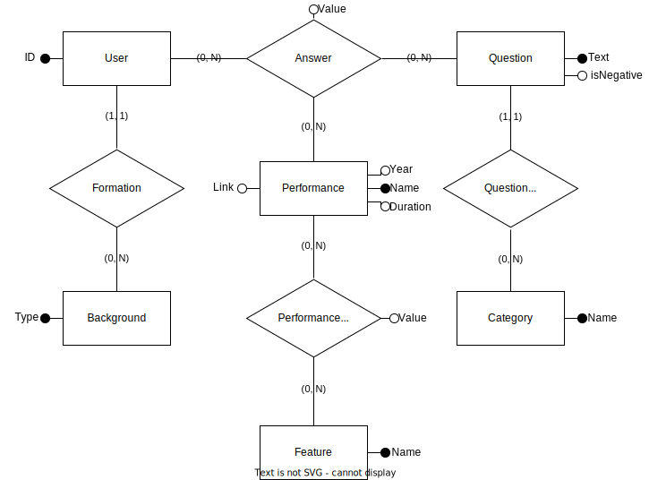
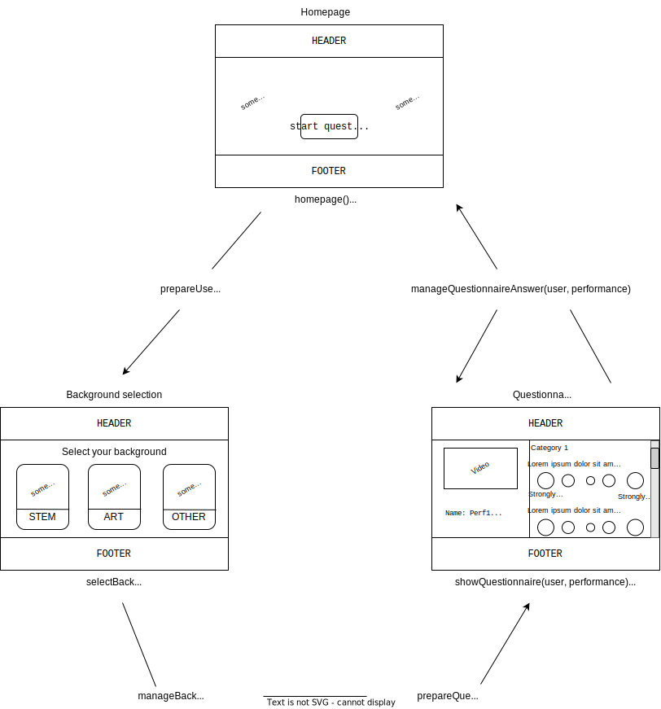

## Database
### Settings
Per settare il database da utilizzare:
1. Creare un file `database.conf`
2. All'interno del file specificare il database da utilizzare utilizzando la seguende sintassi:
`DATABASE(engine, databaseName, username, password, host, port)`
-- `engine` : il database backend da utilizzare, consultare la [documentazione](https://docs.djangoproject.com/en/4.0/topics/install/#database-installation) per ulteriori informazioni. Al momento è stato testato il funzionamento solo con [PostgreSQL](https://www.postgresql.org/);
-- `databasename` : il nome del database da utilizzare. Assicurarsi di aver creato il database prima di procedere;
-- `username` : l'utente con cui l'applicazione andrà a svolgere le operazioni sul database;
-- `password` : la password da usare per connettersi al database;
-- `host` : che host usare per connettersi al database;
-- `port` : che porta usare per connettersi al database;
**N.B. Gli spazi bianchi dopo le virgole per il momento sono obbligatori**

### Schema
Di seguito il [diagramma](./dbschema.svg) che rappresenta le tavole del database e le loro relazioni:

## Sito
### Mappa del sito
Di seguito lo [schema](./sitemap.svg) rappresentante la mappa del sito, un possibile design delle schede, il nome della vista (in [views.py](./polls/views.py)) e del template (in [template/polls](./polls/templates/polls/)) associati alla singola scheda:

### Viste
Di seguito verranno elencate le funzionalità delle viste implementate:
- `homepage()` : renderizza la homepage del sito;
- `prepareUser()` : genera un User da utilizzare successivamente;
- `selectBackground(user)` : renderizza la pagina di scelta del background dell'user;
- `manageBackgroundSelection(user)` : registra la scelta del background;
- `prepareQuestionnaire(user)` : sceglie una performance casuale da cui iniziare il questionario;
- `showQuestionnaire(user, performance)` : renderizza la pagina mostrante il questionario per una certa performance;
- `manageQuestionnaireAnswer(user, performance)` : registra le risposte date dall'user relative alla performance mostrata. Se l'utente ha compilato il questionario per tutte le performance disponibili, verrà indirizzato alla homepage, altrimenti verrà scelta una nuova performance;
